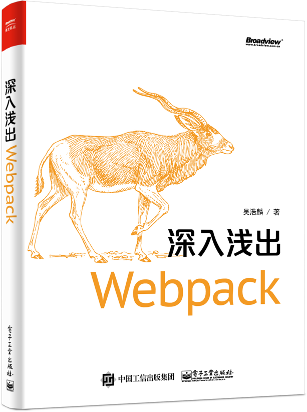

# 深入浅出Webpack

## 评价

> Webpack 凭借强大的功能与良好的使用体验，已经成为目前最流行，社区最活跃的打包工具，是现代 Web 开发必须掌握的技能之一。作者结合自身的实战经验，介绍了 Webpack 的使用与常见优化方法、并深入讲解了 Webpack 原理与架构，相信各阶段的 Webpack 用户都能通过本书得到启发。
> 
> -- [LeanCloud](https://leancloud.cn/?utm_source=webpack_book&utm_campaign=landing) 联合创始人/CEO 江宏
> 
> 本书的内容包含多个主题，Webpack 的用法、配置、使用场景等都有涉及，并且提供所有示例的源码，可以补充 Webpack 官方文档。
> 
> -- 阮一峰（[著名技术博客](http://www.ruanyifeng.com/blog/)，[《ES6 标准入门》](http://union-click.jd.com/jdc?d=Vaj3NC)的作者）
> 
> 我手边需要这样一本书，内容涵盖Webpack，或者说涵盖现代前端技术基础、构建与优化的方方面面。如果你已经上手 Webpack，那么本书将带领你进一步学习，真正掌握 Webpack！
> 
> -- 陆金所前端架构师、[前端外刊评论](https://qianduan.group/)站长 寸志

## 版权许可

电子工业出版社持有本书全媒体形式的出版发行权利。

[吴浩麟](https://github.com/gwuhaolin)拥有本书的著作权。

**其它人不能将本书用于商用用途，不能转载，不能以任何形式发行，违者将追究法律责任**。

## 目录

* [深入浅出Webpack](README.md)
* [前言](PREFACE.md)

* [第1章 入门](chapter1/README.md)
    * [1-1 前端的发展](chapter1/quarter1-1.md)
    * [1-2 前端的发展](chapter1/quarter1-2.md)
    * [1-3 前端的发展](chapter1/quarter1-3.md)
    * [1-4 前端的发展](chapter1/quarter1-4.md)
    * [1-5 前端的发展](chapter1/quarter1-5.md)
    * [1-6 前端的发展](chapter1/quarter1-6.md)
    * [1-7 前端的发展](chapter1/quarter1-7.md)

* [第2章 实战](chapter2/README.md)
    * [2-1 实战](chapter2/quarter2-1.md)
    * [2-2 实战](chapter2/quarter2-2.md)
    * [2-3 实战](chapter2/quarter2-3.md)
    * [2-4 实战](chapter2/quarter2-4.md)
    * [2-5 实战](chapter2/quarter2-5.md)
    * [2-6 实战](chapter2/quarter2-6.md)
    * [2-7 实战](chapter2/quarter2-7.md)
    * [2-8 实战](chapter2/quarter2-8.md)
    * [2-9 实战](chapter2/quarter2-9.md)
    * [2-10 实战](chapter2/quarter2-10.md)

* [第3章 实战](chapter3/README.md)
    * [3-1 实战](chapter3/quarter3-1.md)
    * [3-2 实战](chapter3/quarter3-2.md)
    * [3-3 实战](chapter3/quarter3-3.md)
    * [3-4 实战](chapter3/quarter3-4.md)
    * [3-5 实战](chapter3/quarter3-5.md)
    * [3-6 实战](chapter3/quarter3-6.md)
    * [3-7 实战](chapter3/quarter3-7.md)
    * [3-8 实战](chapter3/quarter3-8.md)
    * [3-9 实战](chapter3/quarter3-9.md)
    * [3-10 实战](chapter3/quarter3-10.md)
    * [3-11 实战](chapter3/quarter3-11.md)
    * [3-12 实战](chapter3/quarter3-12.md)
    * [3-13 实战](chapter3/quarter3-13.md)
    * [3-14 实战](chapter3/quarter3-14.md)
    * [3-15 实战](chapter3/quarter3-15.md)
    * [3-16 实战](chapter3/quarter3-16.md)
    * [3-17 实战](chapter3/quarter3-17.md)
    * [3-18 实战](chapter3/quarter3-18.md)
    * [3-19 实战](chapter3/quarter3-19.md)
    * [3-20 实战](chapter3/quarter3-20.md)
    * [3-21 实战](chapter3/quarter3-21.md)
    * [3-22 实战](chapter3/quarter3-22.md)

* [第4章 优化](chapter4/README.md)
    * [4-1 实战](chapter4/quarter4-1.md)
    * [4-2 实战](chapter4/quarter4-2.md)
    * [4-3 实战](chapter4/quarter4-3.md)
    * [4-4 实战](chapter4/quarter4-4.md)
    * [4-5 实战](chapter4/quarter4-5.md)
    * [4-6 实战](chapter4/quarter4-6.md)
    * [4-7 实战](chapter4/quarter4-7.md)
    * [4-8 实战](chapter4/quarter4-8.md)
    * [4-9 实战](chapter4/quarter4-9.md)
    * [4-10 实战](chapter4/quarter4-10.md)
    * [4-11 实战](chapter4/quarter4-11.md)
    * [4-12 实战](chapter4/quarter4-12.md)
    * [4-13 实战](chapter4/quarter4-13.md)
    * [4-14 实战](chapter4/quarter4-14.md)
    * [4-15 实战](chapter4/quarter4-15.md)
    * [4-16 实战](chapter4/quarter4-16.md)

* [第5章 原理](chapter5/README.md)
    * [5-1 实战](chapter5/quarter5-1.md)
    * [5-2 实战](chapter5/quarter5-2.md)
    * [5-3 实战](chapter5/quarter5-3.md)
    * [5-4 实战](chapter5/quarter5-4.md)
    * [5-5 实战](chapter5/quarter5-5.md)
    * [5-6 实战](chapter5/quarter5-6.md)

* [附录](APPENDIX.md)

